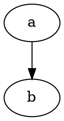
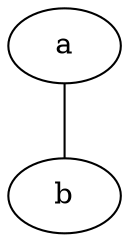
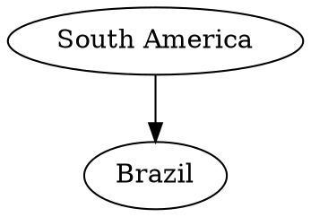
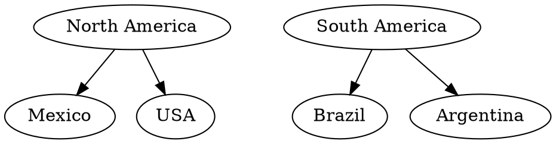
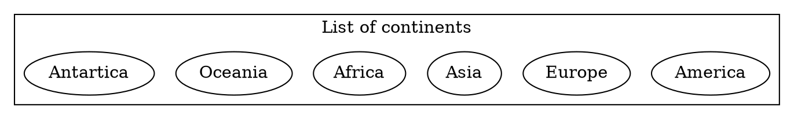

#  GraphViz Explorer

A [GraphViz DOT language](https://graphviz.org/doc/info/lang.html) editor and visualizer.

## Installing

Download the [latest release](/releases/lastest) and drop it on your `📁/Applications` folder.

## Usage

Open a [DOT](https://graphviz.org/doc/info/lang.html) file (`.gv`) through `File` → `Open` (or `⌘ + O`), or start writing your own file.

### Features

- Hold `Shift` and click to select multiple nodes on the graph and highlight their edges.
- Export a `PNG` of the graph with the highlighted nodes and edges for use in presentations.
- You can use the outline in the right panel to hide and show nodes, edges and subgraphs.
  - For complex graphs, you can disable showing disconnected nodes (those not connected to any other node).
- You can resize or hide the editor and outline.

## Basic DOT language

DOT is a language to describe graphs.

You can have either a `digraph` (directional graphs, where edges have an arrow) or a simple `graph`.

or

Nodes can be a single `word` or `"multiple words in quotes"`:

You can also have subgraphs to organize your graph:

Subgraphs can be rendered as their own container boxes (clusters):

DOT is a very flexible language, and you can check the full documentation here: [https://graphviz.org/doc/info/lang.html](https://graphviz.org/doc/info/lang.html)

