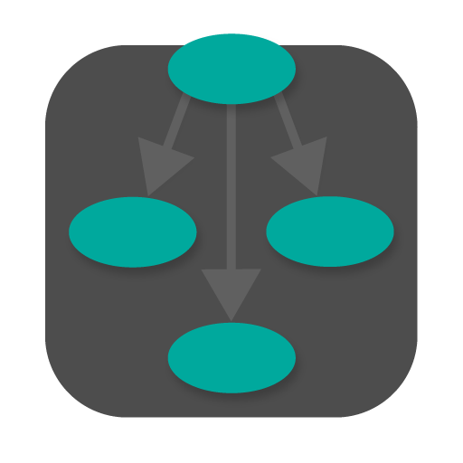

#  GraphViz Explorer

A [GraphViz DOT language](https://graphviz.org/doc/info/lang.html) editor and visualizer.

## Installing

Download the [latest release](/releases/lastest) and drop it on your `📁/Applications` folder.

## Usage

Open a [DOT](https://graphviz.org/doc/info/lang.html) file (`.gv`) through `File` → `Open` (or `⌘ + O`), or start writing your own file.

### Features

- Hold `Shift` and click to select multiple nodes on the graph and highlight their edges.
- Export a `PNG` of the graph with the highlighted nodes and edges for use in presentations.
- You can use the outline in the right panel to hide and show nodes, edges and subgraphs.
  - For complex graphs, you can disable showing disconnected nodes (those not connected to any other node).
- You can resize or hide the editor and outline.

